# Cybersecurity: Splunk Enterprise SIEM Deployment & Configuration

## Table of Contents
- [Introduction to Splunk](#-introduction-to-splunk-enterprise-siem)
- [Project Overview](#-project-overview)
- [Objective](#-objective)
- [System Specifications](#️-system-specifications)
- [Deployment Methodology Workflow](#-deployment-methodology-workflow)
  - [Phase 1: Account Provisioning](#phase-1-account-provisioning)
  - [Phase 2: Package Acquisition](#phase-2-package-acquisition)
  - [Phase 3: Local Installation & Configuration](#phase-3-local-installation--configuration)
  - [Phase 4: Service Initialization & Dashboard Access](#phase-4-service-initialization--dashboard-access)
- [Security Relevance & Impact](#-security-relevance--impact)
- [Ethical Guidelines & Disclaimer](#️-ethical-guidelines--disclaimer)

---

## Introduction to Splunk Enterprise (SIEM)
**Splunk Enterprise** is an industry-leading platform utilized by Security Operations Centers (SOCs) for searching, analyzing, and visualizing machine-generated data in real-time. In the cybersecurity domain, it functions as a powerful Security Information and Event Management (SIEM) tool. Splunk ingests massive volumes of logs from networks, servers, and applications, allowing security analysts to detect anomalies, investigate breaches, and monitor the overall health and security posture of an IT infrastructure.

## Project Overview
This project documents the end-to-end deployment of a local Splunk Enterprise instance. It details the workflow of provisioning an authorized Splunk account, acquiring the correct enterprise binaries, executing a secure local installation on a Windows environment, creating local administrative credentials, and successfully initializing the Splunk Web interface.

## Objective
To establish a functional, locally-hosted SIEM environment capable of indexing log data. This baseline installation will serve as the foundation for future advanced cybersecurity labs, including log ingestion, custom dashboard creation, and threat hunting.

## System Specifications
*   **Operating System Environment:** Windows / Windows Server Architecture
*   **Software Version:** Splunk Enterprise 10.4.2 (64-bit)
*   **Installer Type:** Windows Installer Package (`.msi`)
*   **Web Interface Access:** `localhost:8000`

---

## Deployment Methodology Workflow

### Phase 1: Account Provisioning
**Objective:** To register for the Splunk developer/trial program to obtain the official enterprise binaries safely from the vendor.

To begin the deployment, I initiated a search for the official Splunk distribution channels to ensure software integrity and avoid third-party mirror sites.
 

Navigated to the official Splunk Free Trials & Downloads portal, which hosts the secure enterprise deployment packages.
 

Initiated the account provisioning process by accessing the Sign Up module to create an authorized developer/trial profile.
 

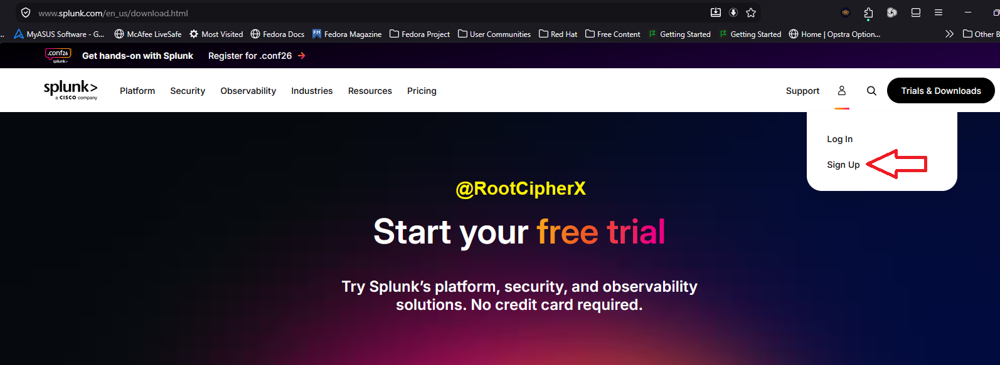

Began the registration process by providing a primary business email address to associate with the Splunk deployment.
 

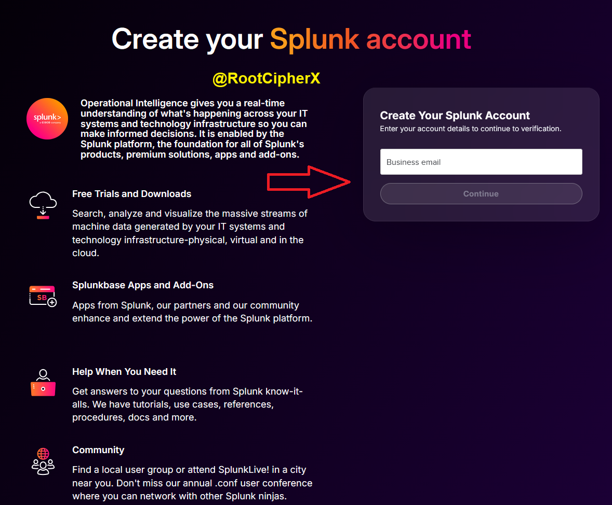

Completed the organizational and personal identity verification forms required by Splunk's software distribution policies.
 

Reviewed and accepted the mandatory licensing, privacy, and terms of service agreements required to finalize account creation.
 

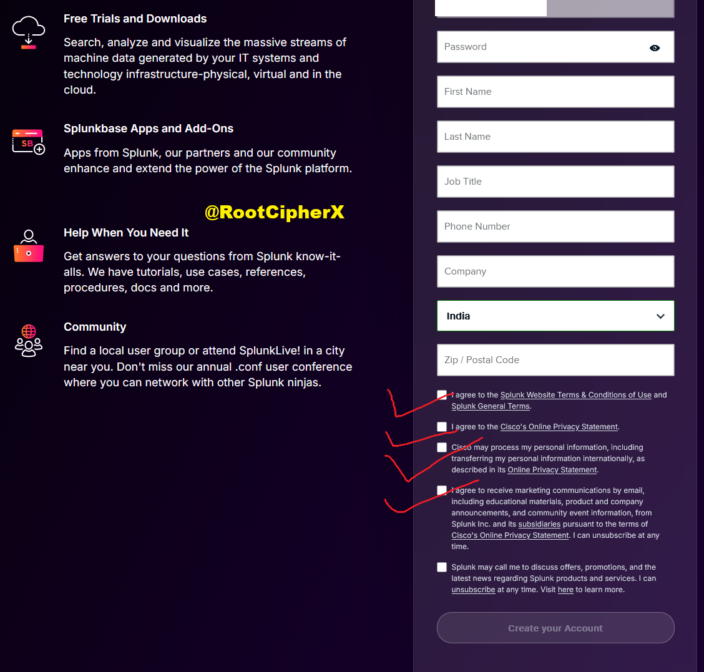

Successfully authenticated the account creation request by verifying the One-Time Password (OTP) delivered securely to the registered email inbox.
 

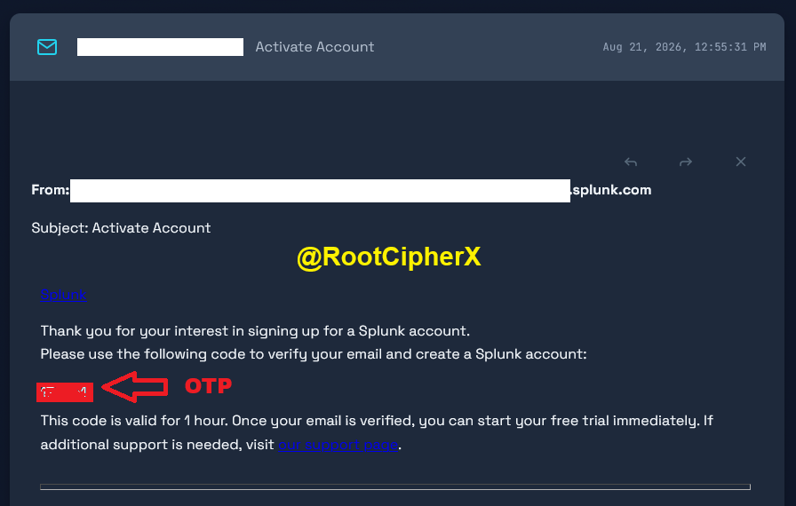

---

### Phase 2: Package Acquisition
**Objective:** To select, authorize, and download the correct Windows 64-bit MSI installer for local deployment.

With the account fully provisioned and verified, I accessed the Splunk Enterprise product catalog to deploy the SIEM on local hardware.
 

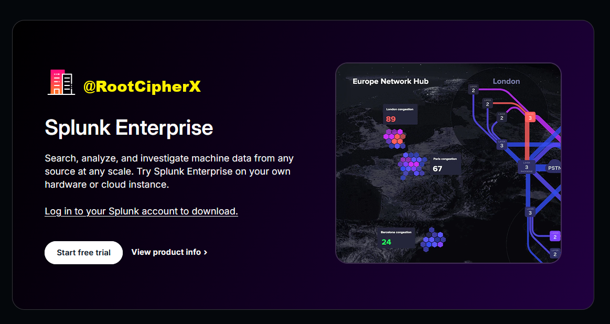

Selected the 64-bit Windows Installer Package (`.msi`) for Splunk Enterprise version 10.4.2, which is optimized for Windows 10 and Windows Server architectures.
 

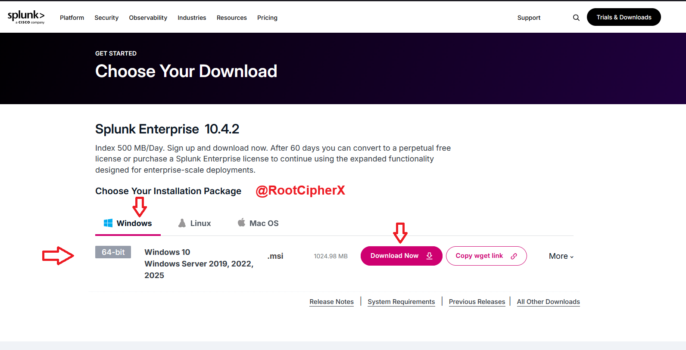

Reviewed and authorized the final Splunk General Terms agreement to bind the software license and initiate the secure download.
 

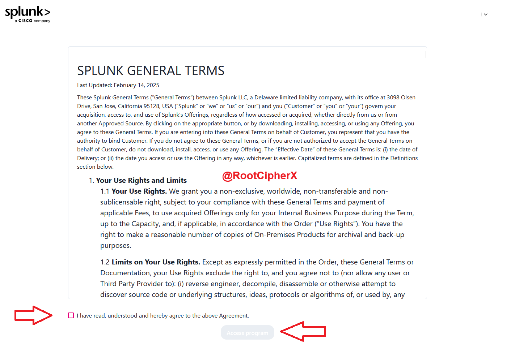

The portal confirmed the authorization and began the secure transfer of the 1.04 GB enterprise binary to the local environment.
 

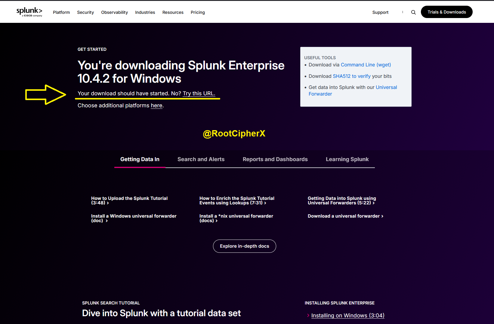

Verified the integrity and successful transfer of the `splunk-10.4.2-33c3bf42cd73-windows-x64.msi` installer package in the local directory.
 

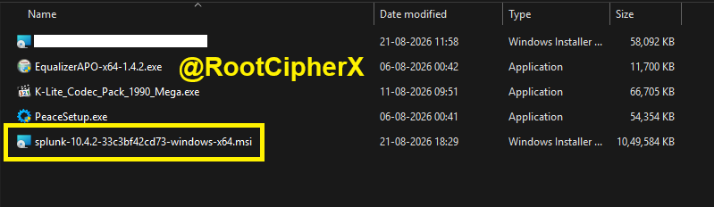

---

### Phase 3: Local Installation & Configuration
**Objective:** To execute the MSI installer and configure the core Splunk services and administrative access controls.

Launched the Windows Installer and accepted the final End-User License Agreement (EULA) to begin unpacking the deployment wizard.
 

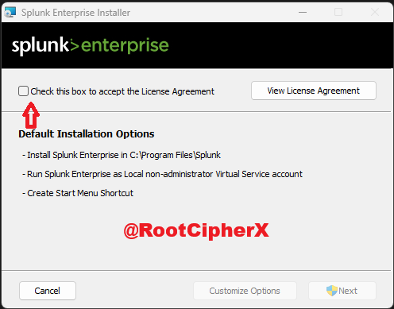

Configured the highly secure local `admin` credentials. This establishes the primary authorization boundary for accessing the Splunk Web interface and management dashboards.
 

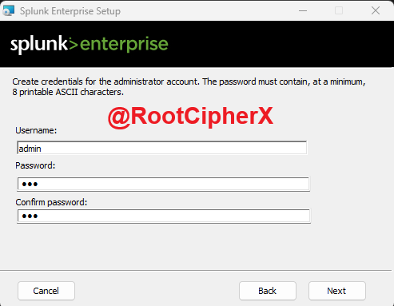

Finalized the installation parameters and initiated the execution of the deployment wizard to bind the software to the local system.
 

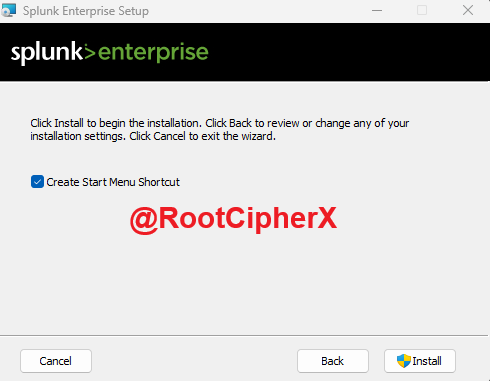

The Windows Installer began unpacking the compressed binaries and allocating the necessary local disk structures.
 

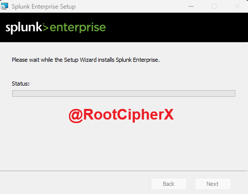

The setup wizard executed background script operations to bind the Splunk services to the host operating system.
 

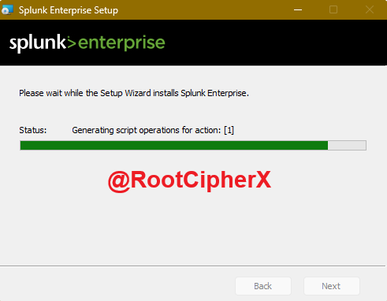

The installer updated the Windows Component Registry to ensure persistent execution and service reliability across system reboots.
 

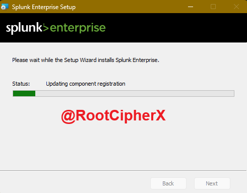

Splunk Enterprise installation completed successfully without errors. Instructed the wizard to immediately launch the web interface for post-installation verification.
 

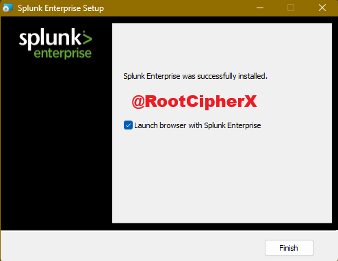

---

### Phase 4: Service Initialization & Dashboard Access
**Objective:** To verify that the Splunk Web interface is active, listening on the correct port, and successfully accepting administrative logins.

The browser successfully routed to `localhost:8000`, confirming the Splunk Web service was actively listening. Authenticated using the local administrative credentials created during Phase 3.
 

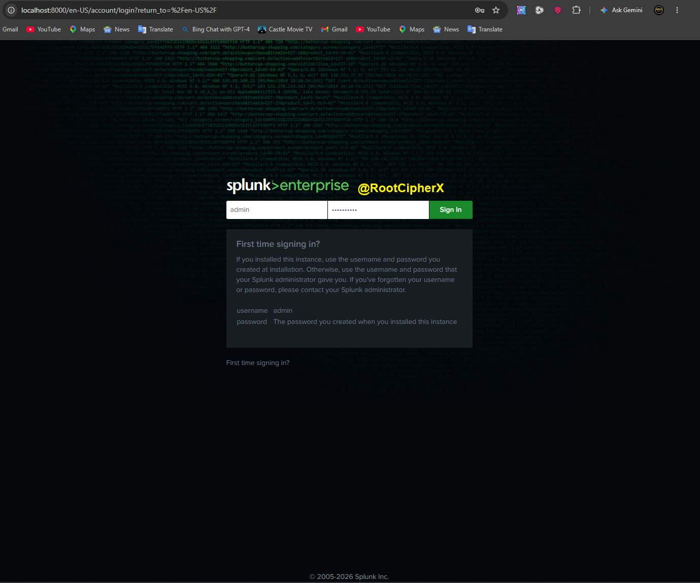

Acknowledged the initial data collection and telemetry prompt presented upon the first successful administrative login.
 

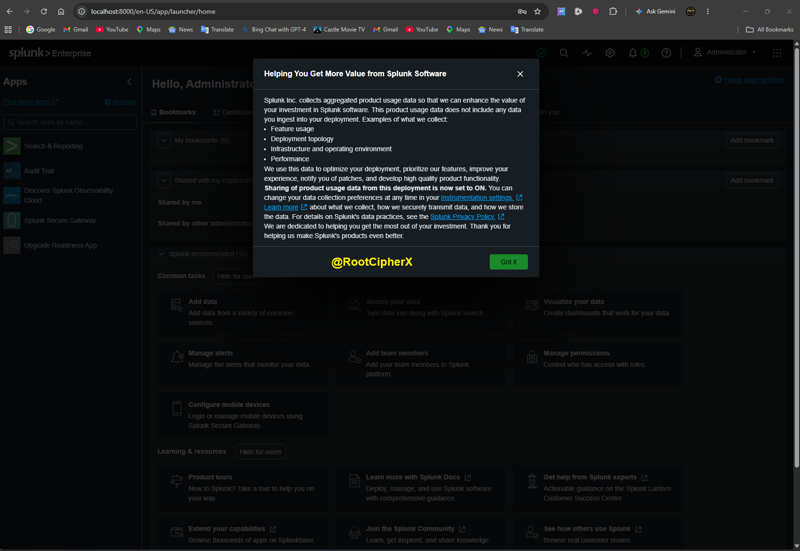

Successfully accessed the primary Splunk Administrator Dashboard. Verified that core functional modules such as "Search & Reporting," "Audit Trail," and standard data ingestion nodes were actively loaded and ready for configuration.
 

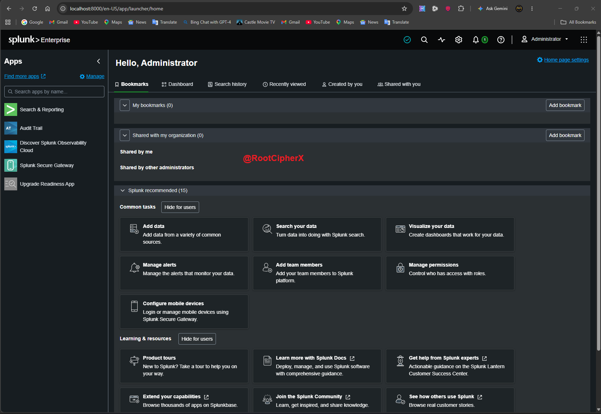

---

## Security Relevance & Impact
Setting up a SIEM like Splunk is a foundational skill for Blue Team operations and SOC analysts. A properly configured Splunk environment allows security teams to:
*   **Centralize Log Management:** Aggregate Windows Event Logs, Sysmon data, and firewall traffic into a single pane of glass.
*   **Threat Hunting:** Query massive datasets to identify Indicators of Compromise (IoCs), lateral movement, or unauthorized access attempts.
*   **Incident Response:** Create automated alerts and real-time dashboards to reduce the Mean Time to Detect (MTTD) and Mean Time to Respond (MTTR) to active cyber threats.

---

## Ethical Guidelines & Disclaimer
This installation and configuration process was performed within a private, authorized laboratory environment strictly for educational and defensive cybersecurity training purposes.
